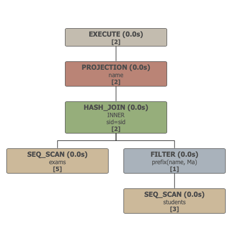

Profiling is important to help understand why certain queries exhibit specific performance characteristics. DuckDB contains several built-in features to enable query profiling that will be explained on this page.

For the examples on this page we will use the following example data set:

```sql
CREATE TABLE students(sid INTEGER PRIMARY KEY, name VARCHAR);
CREATE TABLE exams(cid INTEGER, sid INTEGER, grade INTEGER, PRIMARY KEY(cid, sid));

INSERT INTO students VALUES (1, 'Mark'), (2, 'Hannes'), (3, 'Pedro');
INSERT INTO exams VALUES (1, 1, 8), (1, 2, 8), (1, 3, 7), (2, 1, 9), (2, 2, 10);
```

### Explain Statement
The first step to profiling a database engine is figuring out what execution plan the engine is using. The `EXPLAIN` statement allows you to peek into the query plan and see what is going on under the hood.

The `EXPLAIN` statement displays three query plans that show what the plan looks like as it passes the various stages of the execution engine. The `logical_plan` is the initial unoptimized plan as it is created right after parsing. The `logical_opt` is the optimized logical plan, that demonstrates the equivalent but optimized logical plan after it passes the optimization phase. This optimized plan is then transformed into the `physical_plan`, which is the plan that will actually get executed.

To demonstrate, see the below example:

```sql
EXPLAIN SELECT name FROM students JOIN exams USING (sid) WHERE name LIKE 'Ma%';
```
```
┌─────────────────────────────┐
│┌───────────────────────────┐│
││       Physical Plan       ││
│└───────────────────────────┘│
└─────────────────────────────┘
┌───────────────────────────┐
│         PROJECTION        │
│   ─ ─ ─ ─ ─ ─ ─ ─ ─ ─ ─   │
│            name           │
└─────────────┬─────────────┘
┌─────────────┴─────────────┐
│         HASH_JOIN         │
│   ─ ─ ─ ─ ─ ─ ─ ─ ─ ─ ─   │
│           INNER           ├──────────────┐
│          sid=sid          │              │
└─────────────┬─────────────┘              │
┌─────────────┴─────────────┐┌─────────────┴─────────────┐
│          SEQ_SCAN         ││           FILTER          │
│   ─ ─ ─ ─ ─ ─ ─ ─ ─ ─ ─   ││   ─ ─ ─ ─ ─ ─ ─ ─ ─ ─ ─   │
│           exams           ││      prefix(name, Ma)     │
│   ─ ─ ─ ─ ─ ─ ─ ─ ─ ─ ─   ││                           │
│            sid            ││                           │
└───────────────────────────┘└─────────────┬─────────────┘
                             ┌─────────────┴─────────────┐
                             │          SEQ_SCAN         │
                             │   ─ ─ ─ ─ ─ ─ ─ ─ ─ ─ ─   │
                             │          students         │
                             │   ─ ─ ─ ─ ─ ─ ─ ─ ─ ─ ─   │
                             │            sid            │
                             │            name           │
                             │   ─ ─ ─ ─ ─ ─ ─ ─ ─ ─ ─   │
                             │ Filters: name>=Ma AND name│
                             │  <Mb AND name IS NOT NULL │
                             └───────────────────────────┘
```

We can see that the `logical_plan` contains the unoptimized query plan, involving a cross product and a `LIKE` operation. The optimized plan transforms this plan and pushes down the filters, transforming the cross product into a comparison join. It also recognizes that the `LIKE` operator only does prefix filtering, and transforms the more expensive `LIKE` operator into a cheaper `PREFIX` selection.

### Run-Time Profiling
The query plan helps understand the performance characteristics of the system. However, often it is also necessary to look at the performance numbers of individual operators and the cardinalities that pass through them. For this, you can create a query-profile graph.

To create the query graphs it is first necessary to gather the necessary data by running the query. In order to do that, we must first enable the run-time profiling. This can be done by prefixing the query with `EXPLAIN ANALYZE`:

```sql
EXPLAIN ANALYZE SELECT name FROM students JOIN exams USING (sid) WHERE name LIKE 'Ma%';
```
```
┌─────────────────────────────────────┐
│┌───────────────────────────────────┐│
││        Total Time: 0.0003s        ││
│└───────────────────────────────────┘│
└─────────────────────────────────────┘
┌───────────────────────────┐
│         PROJECTION        │
│   ─ ─ ─ ─ ─ ─ ─ ─ ─ ─ ─   │
│            name           │
│   ─ ─ ─ ─ ─ ─ ─ ─ ─ ─ ─   │
│             2             │
│          (0.00s)          │
└─────────────┬─────────────┘
┌─────────────┴─────────────┐
│         HASH_JOIN         │
│   ─ ─ ─ ─ ─ ─ ─ ─ ─ ─ ─   │
│           INNER           │
│          sid=sid          ├──────────────┐
│   ─ ─ ─ ─ ─ ─ ─ ─ ─ ─ ─   │              │
│             2             │              │
│          (0.00s)          │              │
└─────────────┬─────────────┘              │
┌─────────────┴─────────────┐┌─────────────┴─────────────┐
│          SEQ_SCAN         ││           FILTER          │
│   ─ ─ ─ ─ ─ ─ ─ ─ ─ ─ ─   ││   ─ ─ ─ ─ ─ ─ ─ ─ ─ ─ ─   │
│           exams           ││      prefix(name, Ma)     │
│   ─ ─ ─ ─ ─ ─ ─ ─ ─ ─ ─   ││   ─ ─ ─ ─ ─ ─ ─ ─ ─ ─ ─   │
│            sid            ││             1             │
│   ─ ─ ─ ─ ─ ─ ─ ─ ─ ─ ─   ││          (0.00s)          │
│             5             ││                           │
│          (0.00s)          ││                           │
└───────────────────────────┘└─────────────┬─────────────┘
                             ┌─────────────┴─────────────┐
                             │          SEQ_SCAN         │
                             │   ─ ─ ─ ─ ─ ─ ─ ─ ─ ─ ─   │
                             │          students         │
                             │   ─ ─ ─ ─ ─ ─ ─ ─ ─ ─ ─   │
                             │            sid            │
                             │            name           │
                             │   ─ ─ ─ ─ ─ ─ ─ ─ ─ ─ ─   │
                             │ Filters: name>=Ma AND name│
                             │  <Mb AND name IS NOT NULL │
                             │   ─ ─ ─ ─ ─ ─ ─ ─ ─ ─ ─   │
                             │             1             │
                             │          (0.00s)          │
                             └───────────────────────────┘

┌──────┐
│ name │
├──────┤
│ Mark │
│ Mark │
└──────┘
```

It is also possible to save the query plan to a file, e.g. in JSON format:

```sql
-- enable profiling in json format
PRAGMA enable_profiling='json';
-- write the profiling output to a specific file on disk
PRAGMA profile_output='/path/to/file.json';
```

After these commands have been issued, any query performed will write its profiling output to the specified JSON file.

> This file is overwritten with each query that is issued. If you want to store the profile output for later it should be copied to a different file.

Now let us run the query that we inspected before:

```sql
SELECT name FROM students JOIN exams USING (sid) WHERE name LIKE 'Ma%';
```

After the query is completed, the JSON file containing the profiling output has been written to the specified file. We can then render the query graph using the Python script, provided we have the `duckdb` python module installed. This script will generate a HTML file and open it in your web browser.

```sql
python scripts/generate_querygraph.py /path/to/file.json
```

Alternatively, we can also use the Python API directly to generate the query graph file. This can be done using the following Python snippet:

```python
import duckdb_query_graph
duckdb_query_graph.generate('/path/to/file.json', '/path/to/out.html')
```

This will show us the following query graph:

