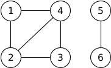

The `WITH` clause allows you to specify common table expressions (CTEs). Regular (non-recursive) common-table-expressions are essentially views that are limited in scope to a particular query. CTEs can reference each-other and can be nested.

### Basic CTE examples

```sql
-- create a CTE called "cte" and use it in the main query
WITH cte AS (SELECT 42 AS x)
SELECT * FROM cte;
```
```
┌────┐
│ x  │
├────┤
│ 42 │
└────┘
```
```sql
-- create two CTEs, where the second CTE references the first CTE
WITH cte AS (SELECT 42 AS i),
     cte2 AS (SELECT i*100 AS x FROM cte)
SELECT * FROM cte2;
```
```
┌──────┐
│  x   │
├──────┤
│ 4200 │
└──────┘
```

### Recursive CTE examples

#### Tree traversal

`WITH RECURSIVE` can be used to traverse trees. For example, take a hiearchy of tags:


```sql
CREATE TABLE tag(id int, name varchar, subclassof int);
INSERT INTO tag VALUES
 (1, 'U2',     5),
 (2, 'Blur',   5),
 (3, 'Oasis',  5),
 (4, '2Pac',   6),
 (5, 'Rock',   7),
 (6, 'Rap',    7),
 (7, 'Music',  9),
 (8, 'Movies', 9),
 (9, 'Art', NULL);
```

The following query returns the path from the node `Oasis` to the root of the tree (`Art`).

```sql
WITH RECURSIVE tag_hierarchy(id, source, path) AS (
  SELECT id, name, [name] AS path
  FROM tag
  WHERE subclassof IS NULL
UNION ALL
  SELECT tag.id, tag.name, list_prepend(tag.name, tag_hierarchy.path)
  FROM tag, tag_hierarchy
  WHERE tag.subclassof = tag_hierarchy.id
)
SELECT path
FROM tag_hierarchy
WHERE source = 'Oasis';
```
```
┌───────────────────────────┐
│           path            │
├───────────────────────────┤
│ [Oasis, Rock, Music, Art] │
└───────────────────────────┘
```

#### Graph traversal

The `WITH RECURSIVE` clause can be used to express graph traversal on arbitrary graphs. However, if the graph has cycles, the query must perform cycle detection to prevent infinite loops.

Take the following directed graph from the [LDBC Graphalytics benchmark](https://arxiv.org/pdf/2011.15028.pdf):



```sql
CREATE TABLE edge(node1id int, node2id int);
INSERT INTO edge VALUES (1, 3), (1, 5), (2, 4), (2, 5), (2, 10), (3, 1), (3, 5), (3, 8), (3, 10), (5, 3), (5, 4), (5, 8), (6, 3), (6, 4), (7, 4), (8, 1), (9, 4);
```

Note that there is a cycle e.g. between nodes 1, 2, and 4. To detect cycles, the query stores the path in a [list](/docs/sql/data_types/list) and, before adding a new edge, checks whether its endpoint has been visited before.

The following query returns **all paths** from node 1:

```sql
WITH RECURSIVE paths(startNode, endNode, path) AS (
   SELECT -- define the path as the first edge of the traversal
        node1id AS startNode,
        node2id AS endNode,
        [node1id, node2id] AS path
     FROM edge
     WHERE startNode = 1
   UNION ALL
   SELECT -- concatenate new edge to the path
        paths.startNode AS startNode,
        node2id AS endNode,
        array_append(path, node2id) AS path
     FROM paths
     JOIN edge ON paths.endNode = node1id
    WHERE node2id != ALL(paths.path) -- detect cycles
)
SELECT startNode, endNode, path
FROM paths
ORDER BY length(path), path;
```
```
┌───────────┬─────────┬───────────────┐
│ startNode │ endNode │     path      │
├───────────┼─────────┼───────────────┤
│ 1         │ 3       │ [1, 3]        │
│ 1         │ 5       │ [1, 5]        │
│ 1         │ 5       │ [1, 3, 5]     │
│ 1         │ 8       │ [1, 3, 8]     │
│ 1         │ 10      │ [1, 3, 10]    │
│ 1         │ 3       │ [1, 5, 3]     │
│ 1         │ 4       │ [1, 5, 4]     │
│ 1         │ 8       │ [1, 5, 8]     │
│ 1         │ 4       │ [1, 3, 5, 4]  │
│ 1         │ 8       │ [1, 3, 5, 8]  │
│ 1         │ 8       │ [1, 5, 3, 8]  │
│ 1         │ 10      │ [1, 5, 3, 10] │
└───────────┴─────────┴───────────────┘
```

To enumerate **all unweighted shortest paths**, run:

```sql
WITH RECURSIVE paths(startNode, endNode, path) AS (
   SELECT -- define the path as the first edge of the traversal
        node1id AS startNode,
        node2id AS endNode,
        [node1id, node2id] AS path
     FROM edge
     WHERE startNode = 1
   UNION ALL
   SELECT -- concatenate new edge to the path
        paths.startNode AS startNode,
        node2id AS endNode,
        array_append(path, node2id) AS path
     FROM paths
     JOIN edge ON paths.endNode = node1id
       -- prevent from adding nodes that were visited previously
    WHERE NOT EXISTS (SELECT 1 FROM paths previous_paths WHERE list_contains(previous_paths.path, node2id))
)
SELECT startNode, endNode, path
FROM paths
ORDER BY length(path), path;
```

```
┌───────────┬─────────┬────────────┐
│ startNode │ endNode │    path    │
├───────────┼─────────┼────────────┤
│ 1         │ 3       │ [1, 3]     │
│ 1         │ 5       │ [1, 5]     │
│ 1         │ 8       │ [1, 3, 8]  │
│ 1         │ 10      │ [1, 3, 10] │
│ 1         │ 4       │ [1, 5, 4]  │
│ 1         │ 8       │ [1, 5, 8]  │
└───────────┴─────────┴────────────┘
```

`WITH RECURSIVE` can also be used to find **all unweighted shortest paths between two given nodes**. The following query returns all unweighted shortest paths between node 1 and node 8:

```sql
WITH RECURSIVE paths(startNode, endNode, path, endReached) AS (
   SELECT -- define the path as the first edge of the traversal
        node1id AS startNode,
        node2id AS endNode,
        [node1id, node2id] AS path,
        (node2id = 8) AS endReached
     FROM edge
     WHERE startNode = 1
   UNION ALL
   SELECT -- concatenate new edge to the path
        paths.startNode AS startNode,
        node2id AS endNode,
        array_append(path, node2id) AS path,
        max(CASE WHEN node2id = 8 THEN 1 ELSE 0 END)
            OVER (ROWS BETWEEN UNBOUNDED PRECEDING
                           AND UNBOUNDED FOLLOWING) AS endReached
     FROM paths
     JOIN edge ON paths.endNode = node1id
    WHERE NOT EXISTS (SELECT 1 FROM paths previous_paths WHERE list_contains(previous_paths.path, node2id))
      AND paths.endReached = 0
)
SELECT startNode, endNode, path
FROM paths
WHERE endNode = 8
ORDER BY length(path), path;
```
```
┌───────────┬─────────┬───────────┐
│ startNode │ endNode │   path    │
├───────────┼─────────┼───────────┤
│ 1         │ 8       │ [1, 3, 8] │
│ 1         │ 8       │ [1, 5, 8] │
└───────────┴─────────┴───────────┘
```

## Common Table Expressions
<div id="rrdiagram"></div>
